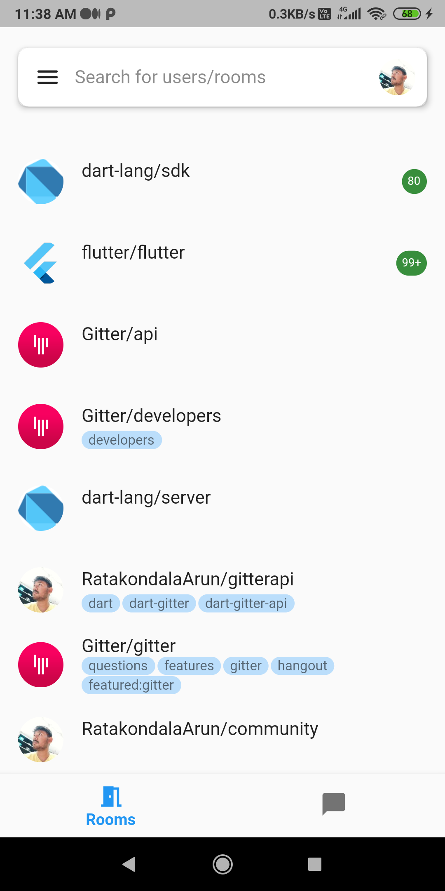
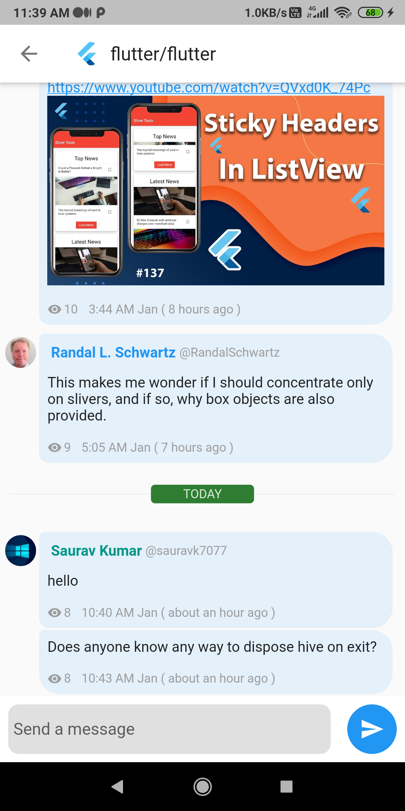
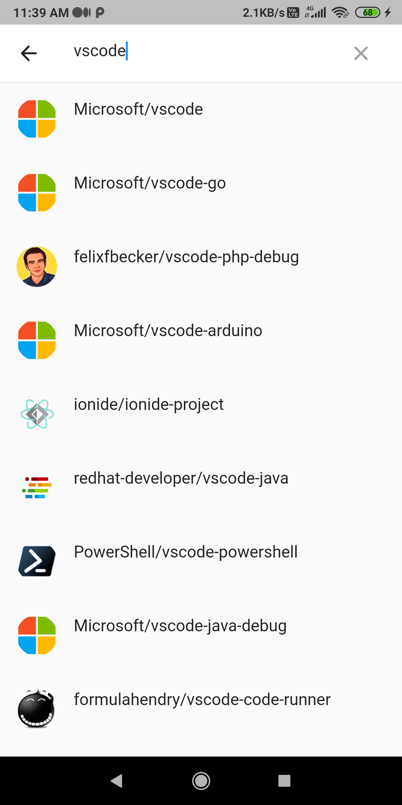

# Gitter Mobile App

[](https://gitter.im/RatakondalaArun/GitterMobile?utm_source=badge&utm_medium=badge&utm_campaign=pr-badge&utm_content=badge)

[Gitter](https://gitter.im/) is a community for software developers.
This project is the mobile application.

*This is an unoffical Gitter mobile app build with flutter and dart.*
*This app is still in development stage.*

</img>
</img>
</img>
</img>

## Prerequisites and start

Follow these instructions to setup and start an environment to develop gitter mobile.

1) You need flutter and dart sdk on you machine.
    - Follow the instructions at Offical [installation guide](https://flutter.dev/docs/get-started/install).

2) Fork and clone this project

    ```bash
    git clone https://github.com/{Your github username}/gitter_mobile.git
    ```

3) Create a file name `keys.dart` under `lib/keys` folder
    This file should contains following code.

    ```dart
    // This are required to get access token from gitter.
    // You can find this under https://developer.gitter.im/apps
    class Keys {
        // This is your app OAUTH KEY
        static const CLIENT_ID = 'Your client id';
        // This is your app OAUTH SECRET
        static const CLIENT_SECERET = 'your client secret';
        // This is your REDIRECT URL
        static const CALLBACK_URL = 'gitter://success';
        // This is the value which is used for call back 
        static const CALL_BACK_URL_SCHEME = 'gitter';
    }
    ```

4) Install Dependencies

    ```shell
    dart pub get 
    ```

5) Now run your app

    ```bash
    flutter run 
    ```

    and select your device.

If you are unable to start the app you can create a [issue](https://github.com/RatakondalaArun/gitter_mobile/issues/new).

Note

- *This app does not support flutter web yet.*
- *Not tested on IOS devices.*
- *Pull requests should be made against `dev` not `main`.*
